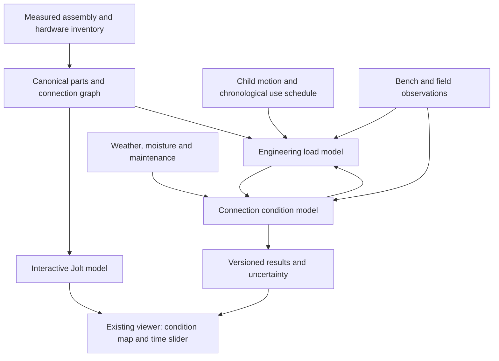

# Bear Basin: realistic physics and 1,000-hour wear simulation

Status: researched proposal, 2026-10-06. **No implementation authorized by this document.**

## Goal and the result we want

Model Nathan's actual playset under **1,000 active hours of swinging by an 80 lb child**, then show where connections experience movement, how their condition changes, and which hardware warrants the most attention. Preserve the existing interactive model and add a reproducible engineering analysis behind it.

The eventual result should be a time slider with a condition map and a report for every relevant connection: loads, retained clamp force, relative slip, fastener rotation or withdrawal, joint clearance, and uncertainty. A user should be able to click the swing-beam bracket and see *why* its condition changes, rather than watch arbitrary damage animations.

There are three deliverables, with different evidence requirements:

| Deliverable | What it establishes |
| --- | --- |
| Connected interactive physics | Installed connections carry loads; detached parts fall; seats swing; supports react. |
| Engineering scenario analysis | Under stated material, usage, weather, and assembly assumptions, calculate loads and compare wear susceptibility. |
| Calibrated wear prediction | Estimate actual deterioration and loosening over time using measured connection behavior and independent validation. |

A convincing animation establishes the first, not the third. Individual claims such as “this screw backs out after 620 hours” require evidence that identifies that mechanism and its rate. Until then, show scenario ranges and unknowns, not invented precision. This model supports understanding and inspection; it does not certify the playset or replace its maintenance instructions.

## Current baseline and gaps

The browser uses Three.js for rendering and Jolt WebAssembly for rigid-body physics. The existing [connected-assembly specification](connected-assembly-physics-spec.md) defines the foundation: explicit joints, connected sections, articulated swings, load-bearing ropes, and ground anchoring.

The inspected manifest has 1,275 render components, 462 connection records, and 849 individual fasteners. It is a useful starting point, but visual geometry is not an as-built engineering survey. The earlier audit found 55 wood/plastic/rope components outside the connection endpoint graph, including all 40 rope components and several seat/handle components. Swing articulation and anchoring also need explicit semantics.

The dimensions, masses, and capacity numbers in `bear_basin/hardware.py` include estimates and unsupported legacy values. **Do not use those capacity fields to calculate fatigue life, release thresholds, or safety margins.** Audit each analytical property separately and retain its source and uncertainty.

Rigid compound bodies are appropriate for fast interaction. They remove the internal flex and connection movement needed to calculate wear. Consequently, adding breakable game-engine joints alone will not accomplish this goal.

## Architecture: shared assembly, two solvers, one condition history

### 1. Canonical assembly description

Give each board, bracket, rope, hanger, fastener, washer/nut stack, and anchor a stable semantic ID. Link it to render objects, manual steps, and physical inspection locations. Enumerated `joint_####` IDs remain compatibility references, not the only durable identity.

For each part record geometry, actual cross-section, mass/density, material, grain orientation where relevant, and the provenance of each field. For each connection record attachment frames, fastener layout, engagement length, hole clearance, washers, locking features, and intended degrees of freedom. Separate render geometry from collision geometry and analytical geometry.

Represent the complete load path from seat through ropes and hangers to beam, brackets, legs, tower, ground contacts, and anchors. The number of visual screws does not determine the number of physical joints. Include the effect of grouped fasteners and eccentric loading.

### 2. Interactive physics

Implement the earlier specification first: intact assemblies, articulated swings, two-way rope forces, correct ground contacts, and explicit anchoring. Use compound bodies for parts that are adequately rigid at the display scale. Keep the worker, fixed simulation steps, interpolation, camera behavior, and performance instrumentation.

The existing disassembly control remains an intentional removal operation. In an ageing simulation, condition changes must come from the analytical condition history. Do not turn the disassembly percentage into an arbitrary strength multiplier.

Jolt is responsible for interaction and collision. Its constraint impulses are not automatically individual screw stresses or bolt preload. Any reduced interactive model used to illustrate frame flex must be fitted to the engineering model and labelled accordingly.

### 3. Engineering load model

Build a separate, headless, double-precision structural dynamics model. Start with timber beam elements, bracket compliance where significant, and semi-rigid connection elements. Select Euler–Bernoulli or Timoshenko elements by a shear-deformation benchmark, rather than using a full solid mesh everywhere.

The connection elements need translation and rotation, initial gaps, friction/slip, bearing compliance, and hysteresis. Fastener groups must distribute shear, axial force, and moment according to geometry and stiffness; dividing every force equally between all screws is insufficient. Wood properties depend on grain direction. Soil/support compliance affects frame motion and load sharing.

Use local finite-element submodels only where necessary: bracket bending, wood bearing beneath washers, fastener-hole contact, or a critical connection that a simpler element cannot represent. Detailed thread contact belongs in a selected calibration submodel, not in a million-cycle full-playset calculation.

Implementation choice: retain Three.js/Jolt for the viewer; use a separately testable numerical analysis package for engineering calculations. Evaluate existing open-source beam/connection solvers against small reference problems before selecting a backend. Do not spend the first phase migrating to a game engine or writing a general-purpose finite-element engine.

The [USDA Wood Handbook](https://research.fs.usda.gov/fpl/wood-handbook) is the starting reference for moisture, mechanical properties, and structural equations. Its [fastenings chapter](https://research.fs.usda.gov/download/treesearch/62253.pdf) addresses wood screws, bolts, bearing, grain direction, and multi-fastener joints. Its strength formulas are not, by themselves, a long-term loosening law.

### 4. Connection condition model

Track distinct physical mechanisms. “Loose” must have an explicit meaning for each hardware class.

| Mechanism | Required state and evidence |
| --- | --- |
| Clamp force loss without rotation | Initial preload, wood compression/creep, moisture-driven dimensional change, washer contact area, joint stiffness. |
| Nut or bolt rotational loosening | Relative transverse slip, thread pitch, preload, friction, locking/prevailing torque, calibrated rotation per exposure. |
| Wood-screw movement | Thread engagement, pilot hole, grain, cyclic lateral/withdrawal loading, wood damage, measured rotation and/or withdrawal. |
| Hole enlargement and bearing damage | Slip history, contact pressure, residual indentation, clearance and stiffness change. |
| Metal fatigue | Actual grade, stress range and concentration, mean stress, appropriate fatigue data. |
| Timber cracking or fatigue | Grain, defects, moisture, local stresses and applicable experimental evidence. |
| Hanger/rope wear | Articulation/contact history, material and geometry, suitable wear data or measured replacement condition. |
| Ground movement | Anchor geometry, soil condition, uplift/slip response, settlement and moisture. |
| Corrosion/decay | Calendar exposure and validated material/environment relationships; otherwise recorded observations or explicit unknowns. |

The [NASA fastener-loosening study](https://ntrs.nasa.gov/api/citations/20180002978/downloads/20180002978.pdf) supports relative sliding as an important route to vibration-induced unwinding. It concerns a different metal assembly; its numerical rates must not be transplanted into this wooden playset. It motivates measuring slip and locking behavior, not a universal “damage per swing” constant.

For each relevant fastener/joint, store:

- Clamp force in N, rotation in degrees, and withdrawal/gap in mm.
- Relative slip amplitude, hole clearance, and permanent wood indentation in mm.
- Translational/rotational stiffness, damping, and their changes.
- Conditional fatigue quantities only where a material-specific model is supported.
- Moisture, maintenance events, parameter sources, applicability limits, and uncertainty.

A wood screw, a barrel nut, a T-nut, and a locknut need different laws. Retightening can restore some clamp force but does not erase crushed wood, enlarged holes, cracks, or worn locking features. Friction and preload influence the onset of slip; changed joint stiffness redistributes loads to neighboring connections. Feed these changes back into the load model.

Torque is not a direct preload measurement. The [NASA Fastener Design Manual](https://ntrs.nasa.gov/api/citations/19900009424/downloads/19900009424.pdf) explains the role of thread and bearing friction in torque–preload relationships. Generic metal-bolt torque tables must not become tightening instructions for the playset: over-tightening can damage the wood, and the manufacturer’s instructions govern.

## Define the 1,000-hour scenario

### Child and swing loads

Use 80 lb as **36.287 kg of child mass**, initially constant. Add actual seat and moving hardware masses separately. Measure rope length and hanger spacing. Model the child’s pumping through physically consistent motion/actuation; avoid arbitrary periodic forces that inject uncontrolled energy.

A passive point-mass pendulum provides an analytical check. For length L, angular displacement θ from vertical, and speed v:

`T = m × (g × cos(θ) + v²/L)`

Released from rest at angle θ₀, its bottom tension is:

`T_bottom = m × g × (3 − 2 × cos(θ₀))`

For the child alone at standard gravity, weight is about 356 N. Bottom tension is approximately 451 N at a 30° release, 564 N at 45°, and 712 N at 60°. These are **ideal passive total suspension loads**, not per-rope or per-bolt loads, and not predictions for an actively pumping child. Unequal rope loading, sideways motion, seat mass, and pumping require the full model.

Define one swing cycle as a complete out-and-back motion. At an illustrative 2–3 seconds per cycle, 1,000 active hours contains about **1.2–1.8 million complete cycles**. Individual force channels can have different peak/reversal counts; count them from their own histories.

The first scenario is one child on one swing. Include amplitude, period, pumping, asymmetry, starts/stops, and occasional off-axis motion as documented inputs. Other children, climbing, jumping, wind and impacts are separate scenarios, not quietly added to this one. The model should accept those later.

### Use, weather and maintenance

Define both active use hours and elapsed calendar time. The same 1,000 hours spread over one year or five years entails different moisture cycles, corrosion exposure and maintenance opportunities.

Store a chronological schedule of sessions, amplitude ranges, rest periods, environmental exposure, and actual maintenance. Use measured distributions when available; otherwise provide named assumption scenarios. Do not imply that assumed behavior probabilities were measured.

The supplied Bear Basin manual’s printed page 7 calls for seasonal maintenance, twice-monthly hardware tightening during play season without over-tightening, swing-beam/hardware checks every two weeks, and monthly wood inspection. It also addresses sealing and uneven settlement. The default scenario must represent that maintenance schedule, with explicit events. An omitted-maintenance comparison is an analytical scenario, not advice to skip checks. Source: Nathan’s `651281-Bear_Basin.pdf`.

Include moisture-driven dimensional change and compression/creep first. Use a moisture-response model with appropriate lag; ambient humidity does not instantly become uniform moisture throughout a board. Treat decay, corrosion, coating ageing and crack growth as unsupported until their inputs and laws are established. Reporting “unknown” is preferable to a fabricated rate.

## Run 1,000 hours efficiently without losing the physics

We do not need to render 1,000 hours or integrate every frame. At 120 steps/second, that would be 432 million full-system steps per scenario. The proposed approach separates repeated swing dynamics from slow condition changes.

1. **Solve representative windows.** Calculate stable cycles, starts/stops, and off-axis events for the current assembly condition. Resolve transients and relevant structural frequencies. Verify timestep and sampling convergence; 120 Hz is an example, not an automatic accuracy guarantee.
2. **Extract connection demand.** Retain forces, moments, stresses, relative displacement and phase. Use appropriate cycle counting for fatigue and full slip/contact histories for loosening. A histogram that discards sequence is not adequate for every mechanism.
3. **Advance a small chronological exposure block.** Update moisture, creep, clamp force and calibrated wear using repeated-cycle or reduced-order laws. Preserve environmental and maintenance order.
4. **Recompute when condition changes matter.** Shorten blocks near slip onset, clearance changes, stiffness loss or another event. Re-solve load sharing after material changes or maintenance. Use explicit windows around transitions.
5. **Check acceleration error.** Compare block advancement with direct integration on shorter histories. Halve block sizes until important outputs converge. No artificial gravity increase or giant timestep to “speed up” ageing.
6. **Run an uncertainty ensemble.** Vary physically justified inputs, including correlated wood and assembly properties. Use reproducible seeds. Start with a small pilot; increase sample count only when sensitivity and convergence justify the cost.

Caching is keyed by assembly topology, condition, usage regime and solver version. Reuse a demand solution only within a verified error tolerance. Stochasticity belongs in physical input variability, not random kicks to make each playback different.

If a mechanism is not calibrated, its output remains a bounded scenario or unresolved quantity. Stop and flag numerical failure or departure from validated conditions; do not continue producing an apparently authoritative wear timeline.

## Data and calibration

The companion [measurement checklist](playset-measurement-checklist.md) separates information Nathan can collect easily from specialist tests. No collection or tests are requested now.

Start with actual dimensions, hardware identification, current age/condition, ground support, maintenance history, and ordinary swing motion. Frame sway and beam deflection help constrain structural stiffness. Visible witness marks can reveal rotation, but cannot establish clamp force or distinguish every underlying cause.

Use representative spare-material connection coupons to identify behavior that observation cannot reveal: load–slip curves, hysteresis, clamp relaxation, hole damage, and rotation/withdrawal rates. Test several specimens and moisture/assembly conditions, and reserve independent specimens for validation. This is controlled bench work, not stressing the occupied playset or using a child as a test actuator.

Match materials, engagement, washers, locking features and assembly procedure to the actual set. Increasing test frequency or load can change the mechanism; establish equivalence before extrapolating accelerated results. A metal-joint paper or a single static pullout test is not enough to identify million-cycle timber-joint behavior.

There are two valid project paths:

- **Without laboratory calibration:** build the load model, perform sensitivity analysis, and produce a transparent inspection-priority map with assumption ranges. Do not label it an exact prediction of screw loosening.
- **With calibration and independent validation:** quantify connection condition changes and uncertainty through the intended load/moisture range. Qualify every prediction outside tested exposure, even if the extrapolation is mechanically motivated.

For this set, initial measurement candidates are the swing hangers, B03 beam, DRB-01/DRB-02 beam brackets, C20 legs/F30 brace, tower attachment, and ground stakes. These are candidates because they form the swing load path—not a claim that they will loosen first. Use actual demand results to choose critical connections for further study.

## Validation and acceptance

Validation is separate from making the scene look plausible. Store fixtures, inputs, reference values and results as versioned artifacts.

| Stage | Required evidence before proceeding |
| --- | --- |
| Assembly | Every load-bearing endpoint mapped; fastener stacks audited; correct articulation; supported intact assembly; reproducible removal/reset. |
| Basic mechanics | Passive pendulum tension/period; equilibrium reactions; beam deflection; mass and inertia; energy behavior without actuation; timestep convergence. |
| Whole-set loads | Observed swing period/amplitude and frame response reproduced; support/joint sensitivities quantified; load path independently checked. |
| Connection behavior | Measured stiffness/slip/relaxation represented; distinct hardware classes; held-out specimen histories; no fitting and testing on the same observations. |
| Wear acceleration | Direct versus accelerated short-history comparison; block-size convergence; threshold crossing resolved; maintenance/weather order preserved. |
| Long-horizon prediction | Intended cycle count and exposure supported by tests or explicitly marked extrapolation; uncertainty includes parameter and model-form error. |
| Viewer/report | Result IDs match physical parts; correct units and provenance; repeatable playback; camera retained; no unsupported safety color or exact lifetime claims. |

Set numerical tolerances before implementation. Proposed starting targets for ideal reference fixtures: about 1% timestep-converged change in key outputs and analytical agreement within the fixture’s numerical/discretization error. Experimental acceptance bounds must reflect instrument precision and specimen scatter, and be chosen before fitting. These are proposed gates, not achieved results.

Perform sensitivity and identifiability checks. If two different combinations of preload and stiffness reproduce the same video, report both plausible parameter ranges; do not present one fitted value as measured. An uncertainty ensemble describes its chosen assumptions; its percentage of loosening cases is not automatically a real-world probability.

The final report must explain which mechanisms were included, excluded, validated or extrapolated. A structural engineer experienced in timber connections should review any results intended to guide safety-related decisions about the actual set. Keep following the manufacturer's inspection/replacement instructions regardless of simulated condition.

## User-facing result

Keep the existing interactive playset. Add a separate analysis mode with:

- Scenario: 80 lb child, 1,000 active hours, usage schedule, elapsed time, environment and maintenance.
- An hours slider with checkpoints such as 0, 10, 50, 100, 250, 500 and 1,000 hours.
- A condition overlay distinguishing predicted movement, reduced clamp force, bearing damage and unresolved quantities.
- Clickable hardware/connection cards with manual code, physical location, demand, condition range, dominant mechanism and evidence level.
- A ranked inspection list that explains its basis; no invented definitive “first screw to fail.”
- Side-by-side maintenance/usage assumptions and reproducible run IDs.
- Downloadable summary and machine-readable results, with solver/input versions and calibration references.

Any visible backed-out screw or enlarged hole must correspond to a calculated, supported state. Exaggerated motion for visibility needs an explicit display scale. A broad uncertainty interval should remain visible instead of collapsing to one dramatic animation.

Personal photos, videos and measurement records stay local by default. The existing repository is public; publishing those data or a new results site needs a separate user instruction.

## Implementation sequence and stop points

| Phase | Work | Exit artifact |
| --- | --- | --- |
| 0. Preserve and audit | Record accepted viewer/version; audit manifest, manual, material assumptions and missing graph edges. | As-built input schema, discrepancy list, source register. |
| 1. Connected mechanics | Implement the prior assembly specification, ropes, articulation and supports. | Verified assembled swing/load path and interactive physics fixtures. |
| 2. Structural loads | Beam/joint model, child motion, ground compliance, analytical and observed-motion checks. | Connection force/slip histories and sensitivity report. |
| 3. Joint condition | Hardware-specific stiffness, preload/slip/creep states; material/property evidence; select critical coupons. | Mechanism model and calibration protocol; preliminary scenario ranking. |
| 4. Calibration | Acquire/test representative joints; fit parameters; validate on held-out specimens and field observations. | Versioned parameter library with applicability ranges and uncertainty. |
| 5. Long exposure | Adaptive exposure blocks, chronological environment/maintenance, direct comparisons and uncertainty ensembles. | Reproducible 1,000-hour report with clearly qualified predictions. |
| 6. Presentation | Connect report to existing viewer, condition timeline, hardware cards and exports. | Reviewed interactive analysis and validation receipt. |

Phases 0–2 are useful even if calibration is postponed: they tell us where loads and movement concentrate. Phase 3 can produce an honest assumption-based risk map. Phase 4 is the evidence gate for reliable individual-hardware wear predictions; it cannot be replaced by more reasoning tokens.

The software work and evidence collection are separate tracks. Bench tests, identifying actual wood/hardware and observing condition may dominate elapsed time. Estimate effort after the Phase 0 audit and one representative joint prototype; do not promise a fixed completion time for calibrated 1,000-hour predictions before knowing what data exist.

## First future implementation session

When Nathan authorizes implementation, begin with Phase 0 and the shared assembly schema. Preserve accepted geometry and viewer controls. Close missing swing/rope/support graph edges, then implement one verified seat-to-ground load path. Build a passive swing reference fixture before adding child pumping or wear.

Stop after a reviewable connected-mechanics milestone if usage is constrained. Do not implement a generic health counter, import unsupported fastener capacities, or claim 1,000-hour accuracy merely because the batch run completes.

## Research register

These sources establish mechanics and data requirements; they do not supply calibrated rates for this particular playset.

1. Nathan's supplied Bear Basin manual, product 651281, especially printed page 7: manufacturer maintenance and wood-weathering guidance.
2. [USDA Wood Handbook, revised 2021](https://research.fs.usda.gov/fpl/wood-handbook): material properties, moisture, timber structural analysis and relevant chapter links.
3. [USDA Chapter 8: Fastenings](https://research.fs.usda.gov/download/treesearch/62253.pdf): wood connection behavior, screw/bolt distinctions, bearing and fastener-group considerations.
4. [NASA Fastener Design Manual, 1990](https://ntrs.nasa.gov/api/citations/19900009424/downloads/19900009424.pdf): preload, friction, torque relationships and fastener design background.
5. [NASA Preload Loss in a Spacecraft Fastener via Vibration-Induced Unwinding, 2018](https://ntrs.nasa.gov/api/citations/20180002978/downloads/20180002978.pdf): evidence for slip-induced unwinding in its tested metal assembly; not timber calibration.

All numerical architecture, implementation phases, proposed validation gates and data structures above are project proposals. They have not been implemented or experimentally verified.
